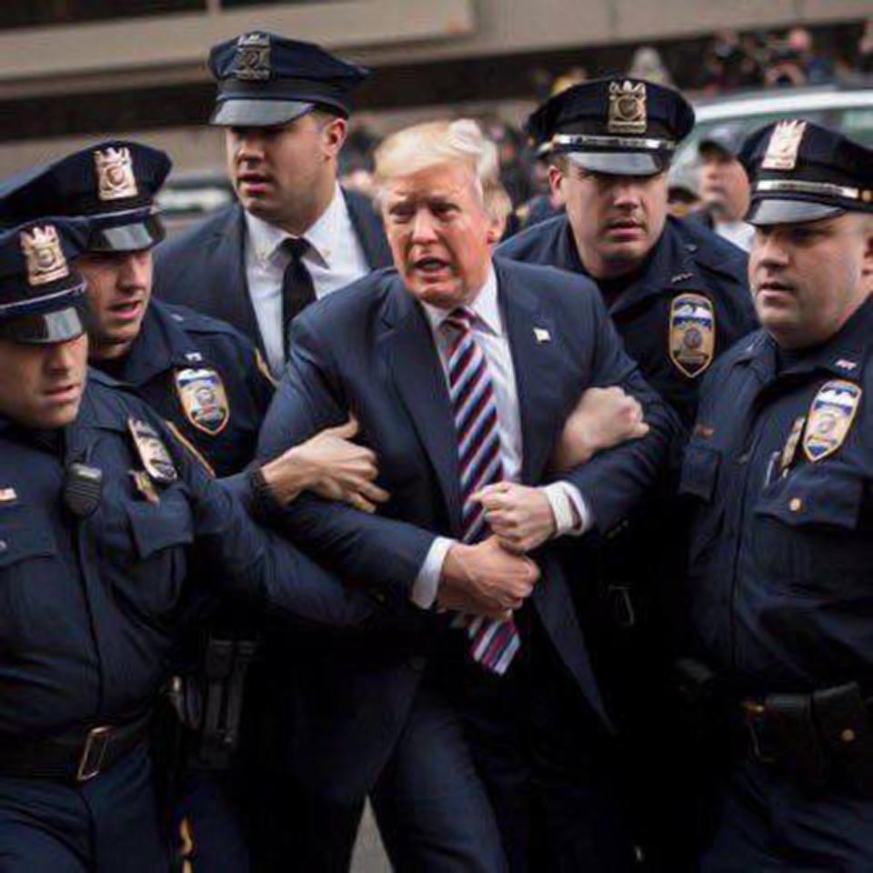

# Stable Diffusion Avatar Generator

> Made with ♥ by Thomas Rüegg and Patrick Wissiak.

**TL; DR**
Stable Diffusion is a modern deep learning model that can generate images from prompts. This report showcases the completely free, community-based tool made by AUTOMATIC1111 which offers a Web UI to handle the Stable Diffusion model. We will also have a look on how to implement a stable diffusion REST API to create a demo application.

## [`stable-diffusion-webui` - The Library](https://github.com/AUTOMATIC1111/stable-diffusion-webui)
The library has a whole list of features, but we are focusing on the most relevant ones regarding Stable Diffusion: text-to-image, image-to-image, and Inpainting. See Appendix B for details about Stable Diffusion.

### Creators/Community
There seems to be a broad community contributing to this library – there are 1.9k Issues and 131 pull requests on GitHub (state 24.04.2023). For development, there is also a Discord channel available (190 members, state 24.04.2023) which is actively used (multiple messages in the last few days).

Except for the UI, the whole application is based on Python, using PyTorch as the deep learning library.

AUTOMATIC1111 also offers a whole bunch of community-created [extensions](https://github.com/AUTOMATIC1111/stable-diffusion-webui/wiki/Extensions). Some extensions cover operations with human pose estimation, gif-to-gif, pixel art, or efficiency plots of the image generation. The variety of extensions is amazing, and they are very easy to install.

### Installation
The library is publicly available [on a GitHub repository](https://github.com/AUTOMATIC1111/stable-diffusion-webui) and can be simply cloned via Git. Afterwards, we completed the guide [Installation on Apple Silicon](https://github.com/AUTOMATIC1111/stable-diffusion-webui/wiki/Installation-on-Apple-Silicon) which was pretty straightforward and did not cause any errors. There are installation guides for [Nvidia GPUs](https://github.com/AUTOMATIC1111/stable-diffusion-webui/wiki/Install-and-Run-on-NVidia-GPUs) and [AMD GPUs](https://github.com/AUTOMATIC1111/stable-diffusion-webui/wiki/Install-and-Run-on-AMD-GPUs) available as well, so the most important platforms seem to be supported.

### Used Model
The library can be used with different pre-trained models. We were using the checkpoints from `stabilityai/stable-diffusion-2-1` on [huggingface.co](https://huggingface.co/stabilityai/stable-diffusion-2-1/blob/main/v2-1_768-ema-pruned.ckpt).

### License
AUTOMATIC1111's stable-diffusion-webui is licensed under "GNU Affero General Public License v3.0". Its code can be modified for commercial use, but the code must be disclosed and published under the same license.

[Link to License](https://github.com/AUTOMATIC1111/stable-diffusion-webui/blob/master/LICENSE.txt)

## Feature 1: text-to-image
In text-to-image, we input a prompt, and Stable Diffusion will return an image. We can also steer Stable Diffusion away from generations we don't want by passing a negative prompt. In the example below, we made sure the generated image looks as realistic as possible by passing negative prompts like "picture frame, unrealistic, cartoon".

<div style="text-align: center;">
  
  <p><em>Figure 1: text-to-image example, trying to create a Shiba Inu dog</em></p>
</div>

There are many more parameters to control, such as the CFG value, which defines how much the prompt conditions the diffusion process. The seed parameter will determine what the random noise will look like at the beginning of the stable diffusion. It is possible to change the sampling method, which will always return a vastly different result. When playing around with that metric, we noticed that the "DDIM" and "Heun" samplers are especially good at achieving usable results (see Appendix D for comparison of different sampling methods). The sampling steps define how many times the sampling reduces noise from the images. To reduce wait times for our testing, the above example finished sampling the image after 14 steps, whereas usually, around 20 steps or more are desired for better results.

As mentioned in Appendix B.2.1, the VAE is responsible for encoding an image into latent space and back. In our case, we used an improved VAE called EMA, [which is particularly good at recreating facial features](https://stable-diffusion-art.com/how-to-use-vae/#Do_I_need_a_VAE). The checkbox 'restore faces' can be used to emphasize that part.

## Feature 2: image-to-image
This feature requires an image and a prompt as input. The generated image will be based on both. By adjusting the denoising strength, it is possible to control how much the model adheres to the given image. In our case, this feature allowed us to preserve the same structure, look, and framing of the existing image but have different content or meaning.

<div style="text-align: center;">
    
    <p><em>Figure 2: image-to-image example, attempt #039492</em></p>
</div>

## Feature 3: Inpainting
Inpainting will allow to change only certain parts of the image. In our example, we took the generated image from the text-to-image example above and inpainted the area where the head of the Shiba Inu dog was. This allowed the stable diffusion to place a cat's head in this position while keeping the rest of the image identical. Thanks to inpainting, we were able to alter an already existing image and create a cat-dog hybrid.

<div style="text-align: center;">
    
    <p><em>Figure 3: Masking the dog's face to allow stable diffusion to draw new content there</em></p>
</div>

## Demo Application
We have built a web application that allows users to access the power of image generation conveniently (see Appendix C for details about the implementation). Users can generate their own avatars by playing around with hair color, hair length, skin color, and eye color. The user will define properties using checkboxes and dropdown menus.

The web application uses the API of the Stable Diffusion library, which will generate an image based on a prompt that our application puts together using the input of the user.

<div style="text-align: center;">
    
    <p><em>Figure 4: Screenshot of our avatar generator web application</em></p>
</div>

The avatar at the top has been generated by the inputs of the user and can be downloaded by clicking on it.

## Conclusion
Stable Diffusion is an astonishing deep-learning model. The process of how a target image is envisioned in a noisy image is amazing and fun to explore. The complexity of the model is intermediate and needs a decent amount of knowledge about AI in general.

The AUTOMATIC1111 library is an elaborate implementation of Stable Diffusion that can easily be used on the device. The basic version provides all the tools to generate images with Stable Diffusion. On top of that, it provides an easy integration of user-created extensions, which also cover more specific applications. The community is extremely active and constantly works on new features and fixing bugs. Altogether, the library did not disappoint in any way, and we can completely recommend its usage for hands-on Stable Diffusion image generation.

The project as a whole was an excellent opportunity to dive into the sensational topic of Stable Diffusion. Not only the generation of images was fun, but also to learn the theory behind it all. We are also very happy with the choice of our library since it ticked all of our basic requirements and many more, such as providing an API which allowed us to create our own sample application that implements Stable Diffusion. Given a suitable use-case, we would definitely use this library in our job or a study project.

## Possible Use-Cases
A possible use-cases for sure is creating avatars, as we did in our demo application. We can also imagine that stock photos will be replaced by Stable Diffusion as long as the images seem realistic. Another use-case is to create Memes from funny prompts such as the ones concerning Donald Trump:

<div style="text-align: center;">
    
    <p><em>Figure 5: AI-Generated image showing <a href="https://stories.as.com/en/amp/has-donald-trump-been-arrested-ai-generated-images-spark-rumors">Donald Trump getting arrested by the police</a></em></p>
</div>

Something that worries us is that fake news will now be even more easily believable because it is possible to create a picture for any idea you want to spread, as seen in the figure above.

Other use cases that we have found promising are [image editing, game design (e.g., generating fictional characters), fashion design, and product design](https://blog.segmind.com/stable-diffusion-deployment/).

## Appendix

### A - More Images
Here we'll showcase some more creations made by using our application.
<div style="text-align: center;">
    
    <p><em>More screenshots of our avatar generation application</em></p>
</div>

### B - Stable Diffusion – The Model
Stable Diffusion is a deep learning model introduced in the paper "High-Resolution Image Synthesis with Latent Diffusion Models" at the end of 2021. It is used as a generative model that can create or alter images based on text prompts. Its most prominent text-to-image model is DALL-E, which is developed and maintained by the AI revolutionists at OpenAI.

The naming of the model comes from physics. Diffusion can be envisioned as a drop of ink falling into a glass of water. At first, the ink is highly concentrated where it fell in, and afterwards, the ink diffuses in the water until equilibrium is reached. Diffusion in physics is defined as irreversible. The usage for image generation is similar to the previous example, but instead of water, we have an image, and instead of ink, we have noise - and the most important difference is that the process of diffusion in deep learning is reversible.

#### B.1 - The Problem
A neural network would naturally tend to always generate the same image upon being given the same input prompt. Since this behavior is not of interest, Stable Diffusion has been introduced. Stable Diffusion starts the image generation with random Gaussian noise in order to generate different images every time.

#### B.2 - The Model Implementation
Stable Diffusion models learn how much noise has been added to an image in order to be able to remove the found noise from the image. Training is done by corrupting an image with a certain amount of noise and then tuning the weights of the model to predict the noise. This process of adding noise to an image, predicting the noise, and removing the predicted noise from the image is repeated until a sufficient image quality has been restored (e.g., by setting a fixed number of iterations).

After training, we can use the diffusion model to generate data by passing random noise through the learned denoising process to get an output image.

<div style="text-align: center;">
    
    <p><em>Figure 6: <a href="https://stable-diffusion-art.com/how-stable-diffusion-work">Successive reduction of noise</a></em></p>
</div>

#### B.2.1 - Latent Space
The diffusion process is, for practical reasons, not being done in image space because it would be computationally very demanding. Instead, the diffusion happens in the latent space. The latent space is 48 times smaller, so it is way faster. The latent space is similar to the token embeddings space for LLMs. The latent space is an internal representation that encodes important information of images in a compressed matter.

To encode and decode from and to the latent space, a Variational Autoencoder (VAE) is used (also called U-Net):

<div style="text-align: center;">
    
    <p><em>Figure 7: <a href="https://blog.segmind.com/stable-diffusion-deployment/">Encoding/decoding to/from latent space</a></em></p>
</div>

Hands and faces can be messed up in the final result when using stable diffusion. This part of stable diffusion is often times [at fault for this](https://stable-diffusion-art.com/how-to-use-vae/#Do_I_need_a_VAE). VAE can be improved to counter such behavior, but more on that later.

#### B.2.2 - Gaussian Noise
Gaussian Noise is noise that follows a normal distribution. An 8-Bit image consisting of two pixel-values (85 and 255) would result in the following probability density function (PDF) if been affected by Gaussian Noise with a variance of 100:

<div style="text-align: center;">
    
    <p><em>Figure 8: Left: PDF of an 8-Bit image with 25% pixels of value 255 and 75% pixels of value 85. Right: Same image corrupted with Gaussian Noise (standard deviation = 10).</em></p>
</div>

#### B.3 - Conditioning (Text Input)
[The purpose of conditioning is to steer the noise predictor so that the predicted noise will give us what we want after subtracting from the image.](https://stable-diffusion-art.com/how-to-use-vae/#Do_I_need_a_VAE) That way, the model envisions the input from the text prompt in the random noise and will gradually form the noisy image into what it has been told the image should be. The text is first converted to an embedding that is understandable by the model and then fed to the noise predictor. In order to do so, a transformer language model is being used.

Stable Diffusion uses self-attention to understand the prompt correctly. For the input "A guy with a red t-shirt", the tokens for "red" and "t-shirt" will be mapped together.

#### B.3.1 – CLIP (Contrastive Language-Image Pre-Training)
CLIP is a pre-trained model released by OpenAI. It is used [to tokenize the text prompt and was trained on a variety of images with captions](https://jalammar.github.io/illustrated-stable-diffusion/).

#### B.4 - text-to-image
One application of Stable Diffusion is to generate an image based on text input. The following steps describe how Stable Diffusion works for text-to-image generation:

1. A random noise image is generated in the latent space (can be based on a seed).
2. The random noise, along with the text prompt, is fed into the noise predictor.
3. The predicted noise is subtracted from the original noise image.
4. Steps 2 and 3 are repeated for a given number of times (e.g., 50 times).
5. In the last step, the obtained image in latent space is decoded by the VAE back to the image space.

#### B.5 - image-to-image
Instead of only feeding a text input to the noise predictor, an input image is being passed as well. Basically, image-to-image generation works the same as text-to-image generation, but the first steps are different:

1. Encode the input image to latent space.
2. Corrupt the input image in latent space with noise. How much noise is added is controlled by an external parameter, the "Denoising strength", which is between 0 (no noise at all) and 1 (the image gets filled with random noise completely).
3. Use the noisy input image in latent space as input for step 2 of the text-to-image generation.

One example of this would be an amateur drawing of an apple, then refining the drawing by using a prompt like "photo of perfect green apple with stem, water droplets, dramatic lighting". Image-to-image will turn it into a professional-looking photo.

<div style="text-align: center;">
    
    <p><em>Figure 9: <a href="https://stable-diffusion-art.com/how-stable-diffusion-work/">An image-to-image example with a green apple</a></em></p>
</div>

#### B.6 - Inpainting
Inpainting works similarly to image-to-image, with the only difference being that the pixels where to add noise are specified by the user. In the following example, the subject's head has been inpainted to look in the other direction.

<div style="text-align: center;">
    
    <p><em>Figure 10: <a href="https://stable-diffusion-art.com/inpainting_basics/">An inpainting example. Left: original, right: inpainted image</a></em></p>
</div>

Therefore, the difference here is that although it is similar to the image-to-image feature, stable diffusion will only change part of the image, as opposed to changing the whole image.

### C – Demo App

#### C.1 - Prompt
The user's preferences will be formed into a prompt that will be passed to the model. To fit this into the context of avatar generation, we have defined default prompts (positive as well as negative prompts) that we send to the model with each request. This is the positive prompt:

```
(({man | woman})), (({blue | brown | red} {long | short} hair)), (({green | blue | brown} eyes)), {beard | ""}, young, ((avatar style))
```

And this is the negative prompt that we have used:

```
{"" | beard}, {woman | man}, out of frame, border, frame, multiple background, text, words, writing, unnatural, poorly drawn face, ugly, disfigured, deformed, watermark, signature, cut off, low contrast, underexposed, overexposed, bad art, beginner, amateur, distorted face
```

The words in the curly brackets "{}" describe variables the user has set using the web application. [Keywords surrounded by one or more parentheses "()" will be focused on more heavily by the model, while keywords surrounded by brackets "[]" are paid less attention](https://www.howtogeek.com/833169/how-to-write-an-awesome-stable-diffusion-prompt/).

#### C.1 - Difficulties
At first, we tried implementing stable diffusion by using its text-to-image feature. After some cumbersome trial and error using various prompts and settings, we noticed that it was difficult to reach the style and look of an avatar in the way we had imagined by only using the prompt as input. Sometimes, the generated image showed something totally not suitable as a profile picture or avatar, e.g., a shuffled picture of a person – or something else.
<div style="text-align: center;">
    
    <p><em>Figure 11: Trial and error with not suitable avatar pictures generated by Stable Diffusion</em></p>
</div>

#### C.2 – Final Implementation
After the bad images we have encountered, we started to make use of image-to-image generation. Next to the prompt, we passed along a basic avatar template utilizing a high diffusion rate of 0.9 to ensure enough variety still. This will make sure the avatar is centered more precisely and also framed right regarding the zoom.
<div style="text-align: center;">
    
    <p><em>Figure 12: <a href="https://laubscher-moser.de/mitarbeiter/karl-heinz-weissmann/default-avatar/">Reference avatar for image-to-image generation</a></em></p>
</div>

### D - Advanced Prompts
AUTOMATIC1111 offers the "X/Y/Z plot" script that can be used to compare different methods. In the UI we can define 3 different parameters that we want to compare. In the below example, we have compared 3 metrics with 3 different values which results in 3! = 27 different images.

<div style="text-align: center;">
    
    <p><em>Figure 13: Settings for Advanced Prompts</em></p>
</div>

These settings then generated the following set of images:

<div style="text-align: center;">
    
    <p><em>Figure 14: Generated images for comparison</em></p>
</div>

### E - Run the avatar generator

#### Install the dependencies
```bash
yarn
# or
npm install
```

##### Start the app in development mode (hot-code reloading, error reporting, etc.)
```bash
quasar dev
```

##### Lint the files
```bash
yarn lint
# or
npm run lint
```

##### Format the files
```bash
yarn format
# or
npm run format
```

##### Build the app for production
```bash
quasar build
```

##### Customize the configuration
See [Configuring quasar.config.js](https://v2.quasar.dev/quasar-cli-webpack/quasar-config-js).
